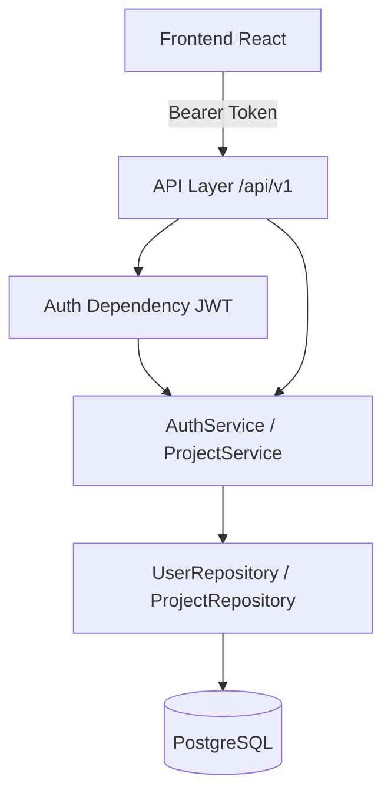

# AI Engineering Copilot — Phase 2 Design（核心业务骨架）

> 基于已确认的 `specs/phase-2/requirements.md`  
> 已确认假设：JWT（无 Refresh）、越权 404、email 登录、单 owner、localStorage、测试库本设计选定  
> 状态：待确认后生成 `tasks.md`

## 1. 架构概览

在 Phase 1 分层之上增加认证与项目域，业务 API 统一挂到 `/api/v1`；`GET /health` 仍在根路径。



**原则：**

- API 只做 HTTP 契约与依赖注入；业务在 Service；持久化在 Repository。
- 密码永不回传；越权项目统一 **404**。
- 不引入 LLM/Agent；不引入 Organization/成员表。

---

## 2. 数据模型

### 2.1 `users`

| 列 | 类型 | 约束 |
|----|------|------|
| id | UUID (PK) | 服务端生成 |
| email | String(320) | UNIQUE, NOT NULL, 小写存储 |
| hashed_password | String(255) | NOT NULL |
| display_name | String(100) | NOT NULL |
| created_at | DateTime(tz) | server default now |
| updated_at | DateTime(tz) | on update |

### 2.2 `projects`

| 列 | 类型 | 约束 |
|----|------|------|
| id | UUID (PK) | |
| owner_id | UUID (FK → users.id) | ON DELETE CASCADE, indexed |
| name | String(200) | NOT NULL |
| description | Text | NULL |
| repo_path | String(1024) | NULL（工作区/本地仓库路径元数据） |
| created_at | DateTime(tz) | |
| updated_at | DateTime(tz) | |

同一 owner 下 `name` **不做**唯一强制（降低本阶段复杂度；可后续加）。

### 2.3 ORM 放置

```
backend/app/models/
  __init__.py          # 导出 User, Project 供 Alembic 发现
  user.py
  project.py
```

`Base` 仍在 `app/db/base.py`；models 继承 `Base`。

---

## 3. Backend API 设计

### 3.1 路由挂载

| 路径 | 说明 |
|------|------|
| `GET /health` | 保持不变 |
| `/api/v1/auth/*` | 注册 / 登录 / 当前用户 |
| `/api/v1/projects/*` | 项目 CRUD |

### 3.2 Auth 接口

| Method | Path | Auth | 说明 |
|--------|------|------|------|
| POST | `/api/v1/auth/register` | 否 | body: email, password, display_name |
| POST | `/api/v1/auth/login` | 否 | body: email, password → `{ access_token, token_type, user }` |
| GET | `/api/v1/auth/me` | 是 | 当前用户公开资料 |

**密码规则（最小）：** 长度 ≥ 8；email 用基础格式校验（Pydantic EmailStr）。

**错误码约定：**

| 场景 | HTTP | code |
|------|------|------|
| 邮箱已注册 | 409 | `email_already_registered` |
| 登录失败 | 401 | `invalid_credentials` |
| 未认证/Token 无效 | 401 | `unauthorized` |

### 3.3 Project 接口

| Method | Path | Auth | 说明 |
|--------|------|------|------|
| POST | `/api/v1/projects` | 是 | 创建 |
| GET | `/api/v1/projects` | 是 | 分页列表（仅本人） |
| GET | `/api/v1/projects/{id}` | 是 | 详情；非本人 → 404 |
| PATCH | `/api/v1/projects/{id}` | 是 | 更新 name/description/repo_path |
| DELETE | `/api/v1/projects/{id}` | 是 | 硬删除；非本人 → 404 |

**分页：** query `page`（默认 1）、`page_size`（默认 20，最大 100）。  
响应：`{ "items": [...], "total": N, "page": 1, "page_size": 20 }`。

### 3.4 分层文件

```
backend/app/
  api/v1/
    auth.py
    projects.py
  services/
    auth_service.py
    project_service.py
  repositories/
    user_repository.py
    project_repository.py
  schemas/
    auth.py
    user.py
    project.py
    common.py          # PageResponse
  core/
    security.py        # hash / verify / create_token / decode_token
    deps.py            # get_db, get_current_user
```

`api/router.py`：保留 health；`include_router(..., prefix="/api/v1")` 挂 auth/projects。

---

## 4. 安全设计

### 4.1 密码

- 使用 **bcrypt**（通过 `passlib[bcrypt]`）。
- Service 层调用 `hash_password` / `verify_password`；Repository 只存哈希。

### 4.2 JWT

- 算法：`HS256`
- Payload：`sub` = user_id（UUID 字符串），`exp`，可选 `email`
- Header：`Authorization: Bearer <token>`
- 配置新增：

| 变量 | 说明 | 示例 |
|------|------|------|
| `JWT_SECRET_KEY` | 签名密钥 | 开发占位长随机串 |
| `JWT_ALGORITHM` | 默认 HS256 | `HS256` |
| `JWT_ACCESS_TOKEN_EXPIRE_MINUTES` | 过期分钟 | `1440`（1 天，开发友好） |

库：**PyJWT**。

### 4.3 依赖注入

- `get_current_user`：解析 Bearer → 查 User → 注入路由
- 项目读写：Service 内校验 `owner_id == current_user.id`，失败 raise `AppError(404, code=project_not_found)`

---

## 5. Alembic

- 新增初始 revision：创建 `users`、`projects` 表与索引/FK。
- `alembic/env.py` 确保 `app.models` 被 import。
- 开发流程：`alembic upgrade head`。
- **禁止**在应用启动时 `create_all` 作为主路径；测试可用 metadata create/drop 加速。

---

## 6. 测试策略

**选定：SQLite 内存库（`sqlite+pysqlite:///:memory:`）用于 pytest。**

理由：不依赖本机 Docker/Postgres。  
实现注意：主键用便携 UUID/字符串策略，避免 PG 专用类型导致测试失败。

`conftest.py`：覆盖 `DATABASE_URL` / `APP_ENV=test` / `JWT_SECRET_KEY`；清 Settings 缓存；建表 → TestClient → 删表；覆盖 `get_db`。

用例：`tests/test_auth.py`、`tests/test_projects.py`；保留 `test_health.py`。

---

## 7. Frontend 设计

### 7.1 路由

| Path | 页面 | 保护 |
|------|------|------|
| `/login` | 登录 | 公开 |
| `/register` | 注册 | 公开 |
| `/projects` | 项目列表 + 创建 | 需登录 |
| `/projects/:id` | 详情 + 编辑/删除 | 需登录 |
| `/` | 可保留 Dashboard，侧栏链到项目 | 需登录 |

### 7.2 模块

```
frontend/src/
  api/client.ts, auth.ts, projects.ts
  auth/AuthContext.tsx, ProtectedRoute.tsx
  pages/LoginPage.tsx, RegisterPage.tsx, ProjectListPage.tsx, ProjectDetailPage.tsx
```

Token：`localStorage` key `aec_access_token`。  
`VITE_API_BASE_URL` 默认 `http://localhost:8000`。  
用 React Context + fetch；不上 axios / 状态库。

---

## 8. 依赖变更

**Backend 新增：** `PyJWT`、`email-validator`、`passlib[bcrypt]`  

**Frontend：** 无强制新依赖（fetch + Context）  

**不增加：** langchain / langgraph / openai / Casbin

---

## 9. 配置与文档

更新根 `.env.example`：

```
JWT_SECRET_KEY=change-me-in-development-use-long-random-string
JWT_ALGORITHM=HS256
JWT_ACCESS_TOKEN_EXPIRE_MINUTES=1440
```

更新 README：迁移命令、认证头示例、Phase 2 页面路径。

---

## 10. ADR 摘要

1. **JWT only**：无 Refresh / Redis Session。  
2. **越权 404**：防枚举。  
3. **email 登录**：唯一账号标识。  
4. **单 owner**：后续 AI 先按个人项目演进。  
5. **测试 SQLite 内存**：开发/生产仍用 PostgreSQL。  
6. **硬删除 Project**。  
7. **localStorage Token**：后续可迁 httpOnly Cookie。  
8. **密码库选 passlib[bcrypt]**。

---

## 11. 待确认

1. 密码库按推荐使用 **passlib[bcrypt]**？  
2. 主键使用 **UUID**？  
3. 测试库使用 **SQLite 内存**？

请确认本 Design。确认后生成 `tasks.md`；你回复「开始执行」后再改代码。
